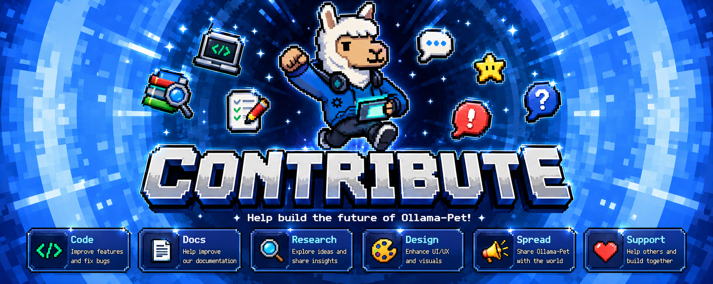

# Contributing to Ollama Pet 🐾



Thank you for your interest in contributing to Ollama Pet! This project is an open-source, community-driven desktop mascot designed to run lightweight local AI assistants directly on your computer.

Here are some guidelines to help you get started with contributing.

## How to Contribute

### Reporting Bugs

If you find a bug, please check the [Issues tab](https://github.com/amvk2/ollama-pet/issues) first to see if it has already been reported. If not, open a new issue and include:

- A clear description of the bug.
- Steps to reproduce the bug.
- Details about your environment (OS version, Ollama version, Node.js version).
- Relevant log output or screenshots if applicable.

### Suggesting Enhancements

We welcome ideas for new features and animations! To suggest an enhancement:

- Open an issue explaining the proposed feature and why it would be useful.
- If it includes new animations, describe the sprite sheets/image assets needed.

### Pull Requests

1. Fork the repository.
2. Create a branch for your changes (`git checkout -b feature/amazing-feature` or `git checkout -b bugfix/some-bug`).
3. Make your changes and write clear, concise commit messages.
4. Ensure the application compiles and works as expected:
   ```bash
   npm run tauri dev
   ```
5. Push your branch to GitHub and open a Pull Request targeting the `main` branch.

## Project Structure

Ollama Pet is built using **Tauri 2**, **React**, **TypeScript**, **TailwindCSS**, and **Zustand**.

- `src/`: Frontend React application.
  - `components/`: UI components (like `Pet` and `Chat`).
  - `assets/`: UI assets, including the animations under `assets/ollamapet_sprite/`.
  - `services/`: API layer for communicating with local Ollama REST endpoints.
  - `stores/`: Zustand stores for shared application state.
- `src-tauri/`: Rust backend, window management, and native system APIs.
  - `tauri.conf.json`: Tauri application configuration.
  - `src/main.rs`: Rust entrypoint.

## Code Style & Standards

- **TypeScript**: Ensure proper type definitions are used. Avoid using `any` unless absolutely necessary.
- **TailwindCSS**: Keep styling clean and use tailwind classes.
- **State management**: Store global state in `usePetStore.ts` and sync across windows using Tauri events (`emit` and `listen`) when necessary.
- **Keep it lightweight**: This app is designed to sit unobtrusively in the background. Keep resource usage low!
