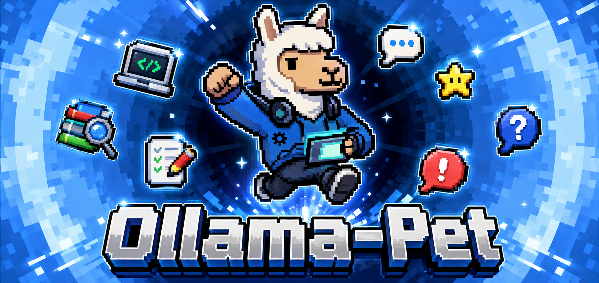
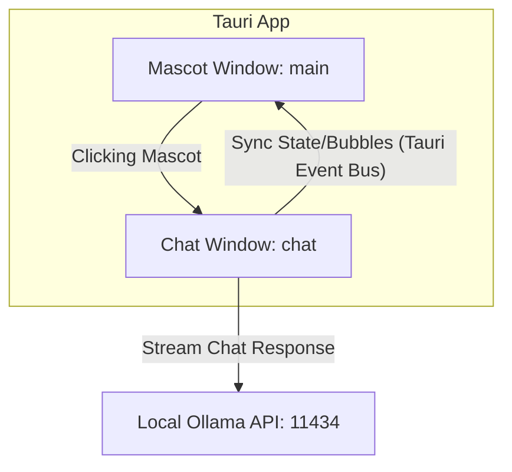

# Ollama Pet 🐾



Ollama Pet is a customizable, interactive, and transparent desktop AI pet widget powered by local LLMs via **Ollama** and built using **Tauri 2**, **React**, **TypeScript**, **TailwindCSS**, and **Zustand**. 

The pet floats on top of your workspace, strolls around your screen, emotes dynamically based on user activity/inactivity, and features a sleek, glassmorphic chat interface to answer your questions in real-time.

---

## Key Features

- 🖥️ **Transparent Desktop Widget**: A frameless, transparent overlay window that stays on top of all other windows.
- 🖱️ **Click & Drag to Reposition**: Drag the pet anywhere on your screen. Left-clicking toggles the chat panel.
- 🚶 **Screen Boundary Walking**: The pet naturally strolls across your monitor(s), turning around automatically when reaching screen boundaries.
- 💤 **Idle & Inactivity Transitions**: Automatically switches states (Idle, Looking, Walking, Typing, Waving, Jumping, Sleeping) based on user activity and inactivity.
- 💬 **Multi-Window Sync Chat**: Clicking the pet opens a separate, glassmorphic chat window. Tauri's event bus (`emit` and `listen`) synchronizes the pet's states (e.g., Thinking, Talking) and speech bubbles in real-time.
- ⚙️ **Configurable local LLMs**: Connects to your local Ollama instance (default: `http://localhost:11434`), auto-fetches available models, and streams chat responses.
- 🎭 **Rich State Animations**: Frame-by-frame sprite sheet rendering based on local assets.

---

## Application States & Animations

| State | Folder | Behavior / Description |
|---|---|---|
| **Idle** | `idle` | Default standing state when active. |
| **Looking** | `looking` | Triggered periodically when looking around or observing cursor. |
| **Thinking** | `thinking` | Plays when Ollama is generating/processing a response. |
| **Talking** | `speaking` | Played while Ollama streams responses. |
| **Typing** | `using_laptop` | Plays occasionally when simulating work. |
| **Walking** | `walking` | Moves the widget across the screen edge-to-edge. |
| **Sleeping** | `sleeping` | Triggered after 10 seconds of system/user inactivity. |
| **Waving** | `waving` | Greeting played when waking up or returning from sleep. |
| **Jumping** | `jumping` | Excited jump sequence triggered periodically. |
| **Dragging** | `walking` | Played when dragging the widget across the screen. |

---

## Tech Stack

- **Desktop Framework**: Tauri 2 (Rust + native system APIs)
- **Frontend Core**: React 19 + TypeScript + Vite
- **Styling**: TailwindCSS v4
- **State Management**: Zustand
- **AI Backend**: Local Ollama REST API

---

## Installation & Getting Started

### Prerequisites

1. **Rust & Tauri Dependencies**: Follow the official [Tauri Setup Guide](https://v2.tauri.app/start/prerequisites/) for your operating system.
2. **Node.js**: Version 18+ is recommended.
3. **Ollama**: Ensure [Ollama](https://ollama.com/) is installed and running locally.
   - Pull a model of choice (e.g., `llama3` or `qwen2.5`):
     ```bash
     ollama pull llama3
     ```

### Local Setup

1. **Clone the Repository**:
   ```bash
   git clone https://github.com/your-username/ollama-pet.git
   cd ollama-pet
   ```

2. **Install JavaScript Dependencies**:
   ```bash
   npm install
   ```

3. **Run in Development Mode**:
   ```bash
   npm run tauri dev
   ```
   This compiles the Rust backend, launches Vite for the frontend, and opens the interactive desktop widget.

4. **Build Production Bundles**:
   ```bash
   npm run tauri build
   ```
   This generates standard, standalone installers (e.g., `.msi` for Windows, `.deb` for Linux, or `.app`/`.dmg` for macOS).

---

## Project Architecture

The app uses Tauri 2's multi-window capabilities to separate the desktop mascot from the chat overlay:



- **Mascot Window (`main`)**: A small transparent 120x120px window that plays animations, monitors mouse/keyboard inactivity, and moves itself along screen boundaries.
- **Chat Window (`chat`)**: A hidden-by-default, glassmorphic 320x380px panel that calls the local Ollama API, pulls tags/models, and handles streaming message UI.
- **Tauri Event Bus**: Uses `listen` and `emit` under `@tauri-apps/api/event` to sync States (e.g., `Thinking` ➡️ `Talking` ➡️ `Idle`) and trigger floating speech bubbles above the pet.

---

## 📖 Extended Documentation

For more in-depth developer information, checkout the resources in the [documentation/](file:///documentation) folder:
* **[Architecture & Window Sync](file:///documentation/architecture.md)**: Details on Tauri 2 multi-window setup and event syncing.
* **[Animation & Sprite Guide](file:///documentation/animation_guide.md)**: Frame-by-frame PNG rendering logic and customization.
* **[Local Ollama API Integration](file:///documentation/ollama_integration.md)**: NDJSON streaming response parser and error mapping.

---

## Customizing Sprites

If you want to customize your own pet:
1. Replace or place PNG frames in `src/assets/ollamapet_sprite/<state_folder>/`.
2. Keep frame file naming numeric (e.g. `1.png`, `2.png`, `3.png`) or alphabetical so they are sorted correctly in [Pet.tsx](file:///src/components/Pet/Pet.tsx).
3. If your frames have a different timing or count, update `ANIM_CONFIG` inside `Pet.tsx` to match the animation loop durations.

---

## License

This project is licensed under the MIT License - see the [LICENSE](file:///LICENSE) file for details.
