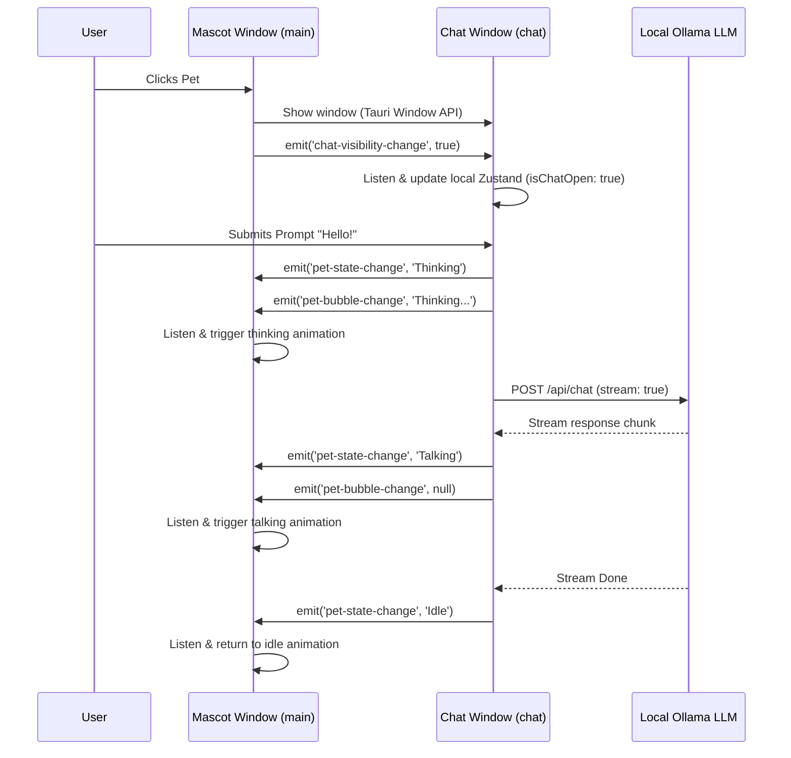

# 🏗️ Architecture & Window Sync Guide

Ollama Pet utilizes a decoupled, multi-window desktop architecture enabled by **Tauri 2**. Instead of hosting the chat panel and the mascot in a single window (which would require a large, invisible, or clunky window container), the application separates them into two distinct native desktop windows.

---

## 🖼️ Multi-Window Setup

The windows are defined in [tauri.conf.json](file:///src-tauri/tauri.conf.json):

1. **Mascot Window (`main`)**:
   - **Properties**: Small (120x120px), transparent, frameless (`decorations: false`), always-on-top, non-resizable.
   - **Purpose**: Houses the pet widget. It is responsible for playing animations, handling cursor click/drag events, tracking system idle timeouts, and moving itself across screen boundaries.
2. **Chat Window (`chat`)**:
   - **Properties**: Standard size (320x380px), hidden by default (`visible: false`), transparent, frameless, resizable.
   - **Purpose**: Displays the glassmorphic chat interface, connects to the local Ollama instance, handles model selection, and formats LLM Markdown output.

---

## 🔄 Real-time Window Communication

Since the Mascot and Chat windows run in separate webview contexts, they do not share a single React state tree. To synchronize state in real-time, we use Tauri's **event emitter bus** (`@tauri-apps/api/event`).

### Tauri Events Used:

- `pet-state-change`: Fired from `chat` to update the mascot animation state (e.g. `Thinking`, `Talking`, `Idle`).
- `pet-bubble-change`: Fired from `chat` to render a short, floating speech bubble over the pet (or hide it).
- `chat-visibility-change`: Emitted to synchronize whether the chat panel is open or closed, which prevents the pet from walking when the chat panel is open.

---

## 🗃️ Global State Management (Zustand)

Global state is governed by [usePetStore.ts](file:///src/stores/usePetStore.ts). The store manages:
- **`petState`**: The current mascot animation state.
- **`isChatOpen`**: Controls layout parameters and coordinates walking halts.
- **`messages`**: Stores conversation history.
- **Ollama Settings**: Holds connection strings (`ollamaUrl`), selected model (`selectedModel`), and list of fetched local models.

> [!NOTE]
> Each window runs a separate instance of the Zustand store in its own JS runtime. While frontend states like `ollamaUrl` or `selectedModel` are read individually, critical interactions are bridged using the Tauri Event Bus to keep stores synchronized.
